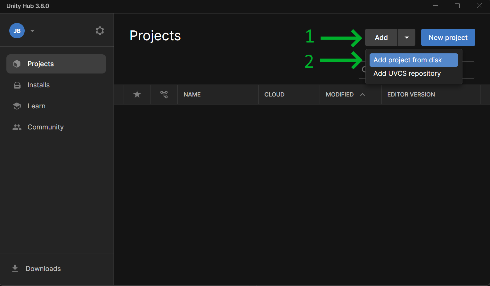
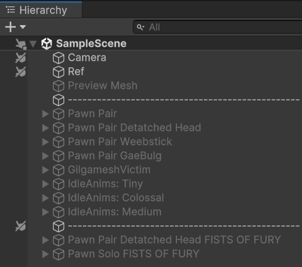

# Creating new animations

**HELP**: If you get stuck on any part of this guide, or have any questions about the systems available, I can normally be contacted on Discord under the @epicguru handle or by opening an issue on this page.

## Basic setup
You should have a mod folder set up, with an `About.xml` file so that the mod can load correctly, even if the mod has no content or code.  
Next **create a new folder** inside your mod folder, called `Animations`.  
Your mod folder structure should now look like this:  
```
MyModName/  
├─ About/  
│  ├─ About.xml  
├─ Animations/  
```

## Setting up the editor

Inside the `Source/Animations` folder is a Unity project that is used to create the animations for this mod.  
The [Unity Animation Editor](https://docs.unity3d.com/6000.0/Documentation/Manual/animeditor-UsingAnimationEditor.html) is used to create animations using keyframes - if you have used Blender, Spine or other keyframe animation software, you will find it quite easy to use.  
A full Unity and Unity animation tutorial is outside the scope of this guide, so please take some time to understand the editor if you are not already familiar with it.

 - Install Unity Editor version 6 (6000.0) or above.
 - Add the Animation project, in the `Source/Animations`, to Hub to allow you to open it:  
 - Open the Animation project. You may see a warning about changing the unity editor version, this is fine.
 - Once the project has opened (this may take a while the first time), you should see a button in the top menu called `Melee Animation`.  
   Click this button, then click `Set Export Location`. This will tell the editor where to put the animation files that you create.
   
 - Set the export location to the `Animations` folder, inside your mod folder, that you created earlier.
 - From the top menu, select *File > Open Scene* and open the scene at `Assets/Scenes/SampleScene.unity`. You should now have something like this:  
 - Next you need to adjust the camera so that it is suitable to animate characters. In the top-right of the Scene view, click the following in this order:
   1. The green *Y* arrow.
   2. The center white box.
   3. The 'lock' icon.  

 - Almost ready to animate! Make sure you have the *Animation* window open, press `Ctrl+6` if it is not open to open it quickly.

## What rig to use?
In the hierarchy on the left you will see several game objects with different names. Each of these 'rigs' are used to create different types of animations.
  
A breakdown of the existing rigs are as follows:  
| Rig Name                 | Used For                                                                                                 |
|--------------------------|----------------------------------------------------------------------------------------------------------|
| Pawn Pair                | Generic two-pawn rig, used for almost all execution and duel animations.                                 |
| Pawn Pair Detatched Head | Two-pawn rig, used for execution animations that need to behead the victim.                              |
| Pawn Pair Weebstick      | Rig used for the Scarlet Edge unique skill execution.                                                    |
| Pawn Pair GaeBulg        | Rig used for the GaeBulg unique execution.                                                               |
| GilgameshVictim          | Rig used for the Mystic Summon unique skill execution.                                                   |
| IdleAnims: Tiny          | Rig used for the idle animations for Tiny weapons, including movement, attacking and flavour animations. |
| IdleAnims: Medium        | Same as above, for Medium weapons.                                                                       |
| IdleAnims: Colossal      | Same as above, for Colossal weapons.                                                                     |


**Generally you will want to use the `Pawn Pair` rig to create execution animations.**

Start by clicking on the Pawn Pair object and enabling it in the Inspector tab:  
  

You should now see something like this:
  
If you do not see the two pawns, double click on the Pawn Pair object, this will focus the scene camera on them.  
You can zoom using the scroll wheel, and move the camera by pressing down the middle mouse button and dragging.