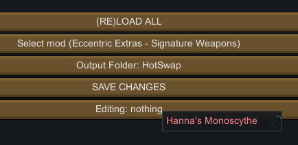
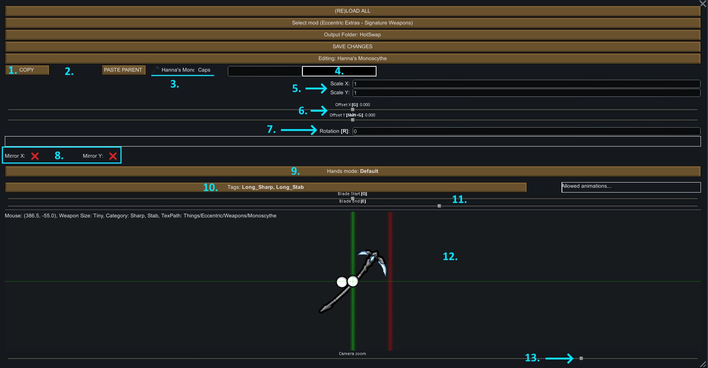

# Tweak Data aka Make Weapons Compatible
In order for a weapon to be used in animations, *tweak data* needs to be created for each melee weapon.
This is because each weapon sits differently within it's texture - the animation needs to know how to position, rotate and scale the texture in such a way that it looks correct when animated.
There is also additional information such as blade length, weapon type (sharp, blunt) and weapon size (short, long) that need to be specified.

## Tweak Data Editor
Tweak data is stored in a *.json* file inside the `ItemTweakData` folder in the root folder of a mod. However, you don't have to edit that json by hand. There is an editor included with the mod. To access it, enable developer mode, then go to actions and click **Open Tweak Editor**.

## Setup
When you first open the editor it will look like this.

First, click the top button, **RELOAD ALL**.
Next, click **Select mod**.

This will open up a dropdown listing all active mods that add melee weapons, alongside the number of weapons. Mods in green are mods that have all their tweak data populated. Mods in yellow or red are missing tweak data. In this guide I will be using *Eccentric Extras - Signature Weapons* as the example mod that I will make compatible.

With the mod you want to make compatible selected, you will now see 2 new buttons. The first one will be **Output Folder**. This button changes *where* the tweak file will be stored.
Click the button to change the output mod:
 * If you are the author of the mod that needs making compatible, set the output mod to your mod.
 * If you are **not** the author of the incompatible mod, but you are instead making a patch mod, set the output mod to your patch mod.

With that done, you can now click the **Editing: nothing** button to pick a weapon to make a patch for. In this example, there is just a single weapon:

## Interface
Selecting a weapon will open up the full editor interface - and there's quite a lot going on. If you haven't already, make sure you resize the editor window to make it large enough to see everything. Don't worry, you will not have to use 90% of the controls on this screen, but they are all explained below.

---

**The goal is to position the weapon so that the point faces to the right, the sharp edge faces downwards, and the hilt is placed in the pawn's hands.**

---

1. This button copies the current tweak data values. This is very useful if you have multiple weapons that use the same or very similar texture.
2. The *Paste* button appears here once you copy. Clicking it applies the copied tweak values.
3. Hovering your mouse over these two options will display information about the weapon.
4. Clicking this box will allow you to change the color of the weapon trail. By default, the trail is white (even if the box is black).
5. These two values represent the scale (size) of the weapon. Normally these two values should be the same, otherwise ther weapon could be distored. **By default, these scale values are set to the \<drawSize\> values for the weapon.**
6. The X and Y offset of the weapon sprite. You can change them manually, but it is much more convenient to use the **G key** to move horizontally and **SHIFT + G** to move vertically.
7. Change the rotation of the weapon sprite. You can adjust it manually here, but it is much more convenient to use the **R key** to rotate (rounding to 5 degrees) or **SHIFT + R** to rotate without rounding.
8. These two toggles change the flipping (mirroring) of the sprite. Use these if the weapon in facing backwards or the sharp edge is pointed up rather than down.
9. Change the number of hands on the weapon. The options are:
   1. *Default*: Show both hands.
   2. *Only Main Hand*: Show only 1 hand.
   3. *No Hands*: Hands are hidden.
10. Click this to change the 'type' of the weapon. The type determines what animations are available. There are 6 options, you can (and should) select multiple options at once:
    1.  *Long blunt*: For long blunt weapons. Can do large bashing attacks.
    2.  *Long sharp*: For long weapons with a sharp edge. Can do sweeping attacks.
    3.  *Long stab*: For long weapons with a sharp point. Can to stabbing and lunging attacks.
    4.  *Short blunt*: For short blunt weapons. Can do bashing attacks.
    5.  *Short sharp*: For short weapons with a sharp edge. Can do slicing and sweeping attacks.
    6.  *Short stab*: For short weapons with a sharp point. Can do stabbing attacks.
11. These sliders adjust the position of the start (green) and end (red) positions of the weapon blade. Use the **Q** and **E** keys to adjust these positions more easily.
12. The main preview window. Shows the weapon and pawn hands. When using hotkeys, you should use them inside this window.
13. A slider to adjust the zoom of the preview window.
---
Here is a correct tweak preview looks like. Notice: the hands on the hilt, the blade faces downwards and the start (green) and end (red) of blade positions are set correctly:

## Saving
Click the **SAVE CHANGES** button to save the current mod's changes to the output folder. Important: you must click this button for each mod you are patching. After clicking this button, make sure that the files have been created by checking your mod (or patch mod) folder - you should see a folder called `ItemTweakData` that contains 1 or more `.json` files.

## Final notes
Now that you tweak is created, it will be applied in-game. You can preview the weapon immediately, just load up a save. Tweak data is loaded in mod load order: if there are multiple mods that provide tweak data, the one loaded lower down is used.